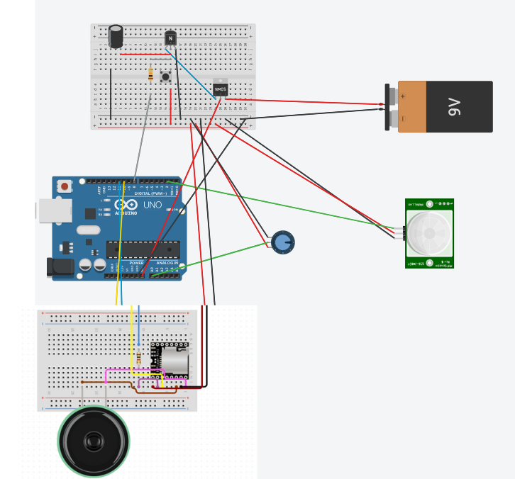

Designing a music player with a latching circuit that cuts power when the microcontroller is inactive. A PIR sensor will send signals to the latching circuit as long as it detects motion. When no motion is detected, the latching circuit should begin powering off the device.

The microcontroller will keep sending signals to the latching circuit using `LATCH_PIN` to keep it powered on, but when the PIR sensor stops detecting motion the microcontroller will stop sending signals, allowing the latching circuit to cut power.

For the music player, we will use the MP3-tf-p module to play audio files. The volume can be controlled using a potentiometer.

### Items used
- MP3-tf-p module
- Speaker
- Potentiometer (controlling sound volume)
- PIR sensor
- Mosfet
- NPN transistor
- Capacitor

### Circuit Diagram
